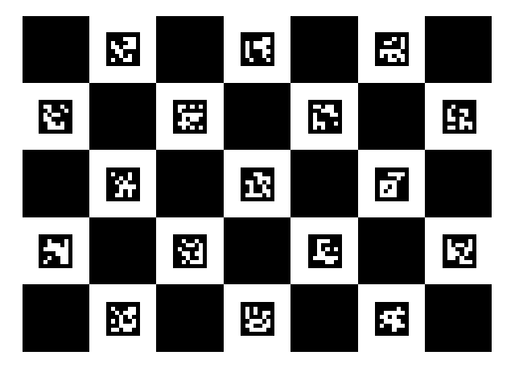
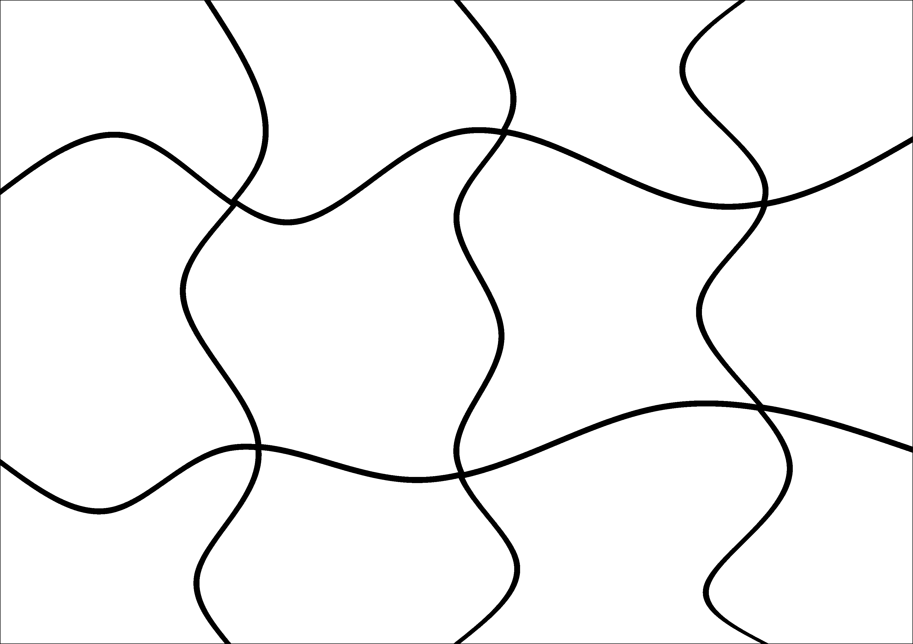
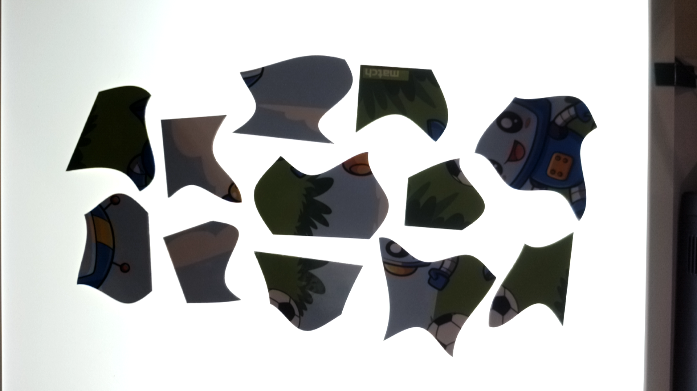
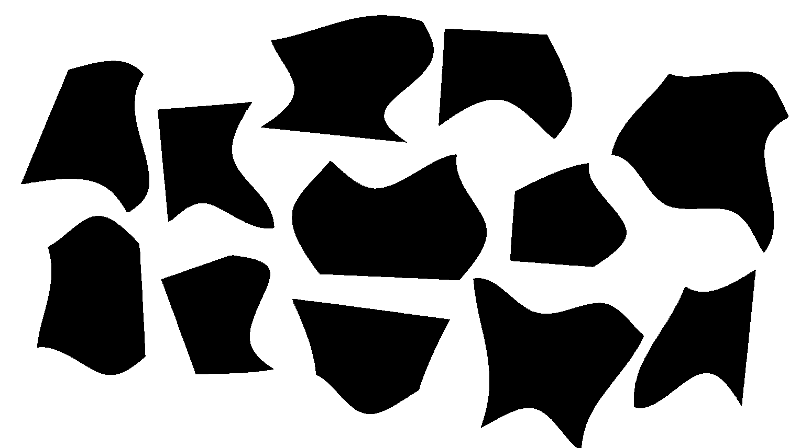
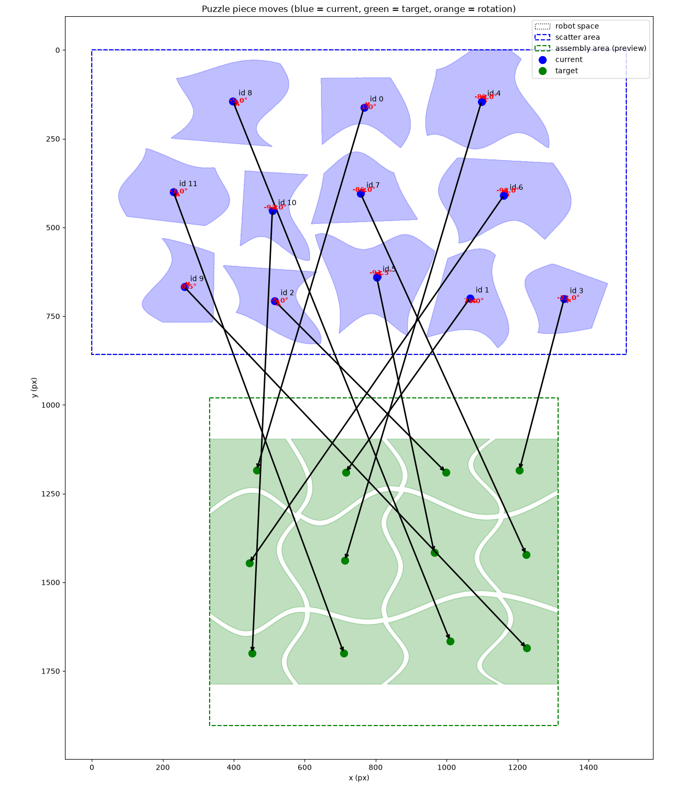

# Robot Puzzle Solver

Using computer vision techniques, solve and assemble a puzzle using a UR 10e robotic arm.

*This repository was created by Olivia Cai as a RISE Germany 2026 research intern for the Leibniz University Hannover's Institute of Assembly Technology and Robotics.*

For **software development** and setting up the repository with real hardware, read file `SETUP.md` in this repository.

# Algorithm Pipeline

## Calibration

Perform hand-eye calibration and calculate the transformation matrix from image coordinates to the robot's coordinates using a ChArUco board. 

*ChArUco board*

## Answer Key Generation

The puzzle that the robot would like to solve is provided as a black and white image. Black lines seperate puzzle pieces from each other so that individual pieces can be identified. The principal components, moments, area, and contour of each piece is computed and saved.

*Solved puzzle image*

## Computer Vision

### Puzzle Piece Detection

Using the eye-in-hand robot camera, capture a photo of the puzzle pieces scattered on top of a bright LED screen. Then, process the image so that pixels are sharpened and either black or white; puzzle pieces become black, and the background becomes white.

*Raw image*

*Processed image*

### Blob Analysis

Each black "blob" is identified as a puzzle piece and the contours and area of the piece is stored.

### Principal Component Analysis

The moments and principal components of each blob is computed. A best fit algorithm is used to match these characteristics to the pieces identified during answer key generation. 

## Robot Programming

A TCP connection is used to send URScript messages to the Universal Robot 10e robot arm and the Schmalz Cobotpump vacuum gripper. The translation and rotation in robot coordinates to pick up scattered pieces and place them is calculated. A digital logic input is used to enable and disable the gripper's suction. 

